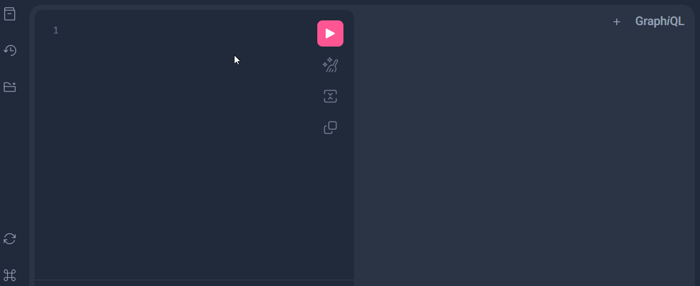
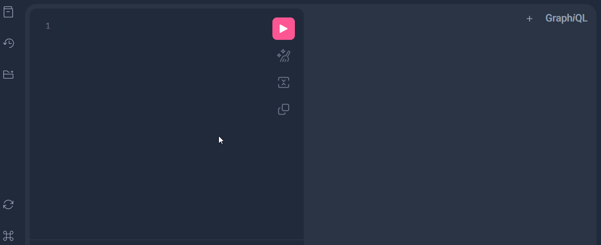
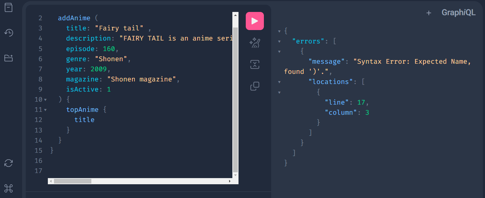
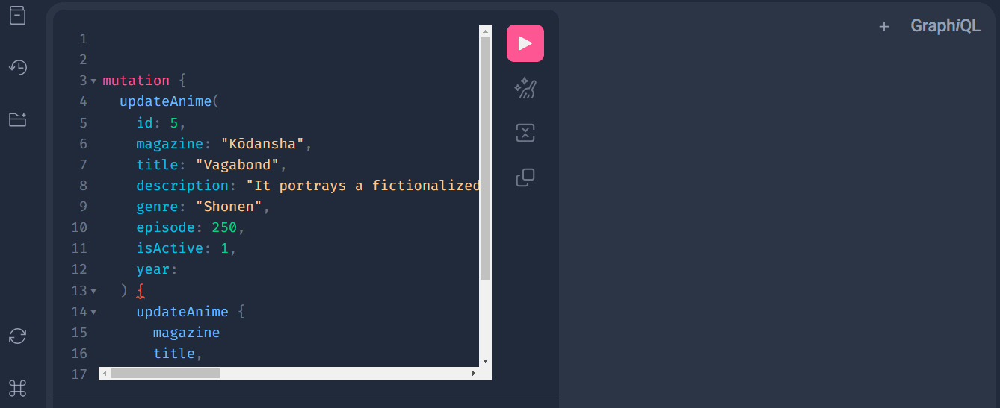
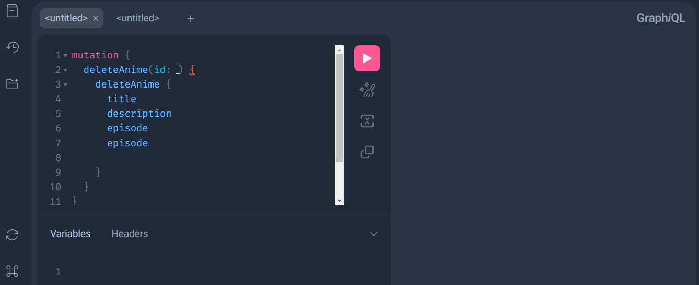

# Top 20 animes API GraphQL


Api basada en la arquitectura de GraphQL, en la que el usuario puede consultar el top 20 de los mejores animes del genero shōnen, además permite listar las consulas, agregar, actualizar y eliminar recursos.


# Tecnologías usadas
- Python versión 3.8.5
- Django rest framework versión 3.14.0
- IDE (Visual studio code)
- GIT versión 2.37.2.windows.2


# Instalación

1. Clona este repositorio: `https://github.com/AndresSilverall/query-top-20-animes-api.git`
2. Navega a la carpeta del proyecto: `cd query-top-20-animes-api`
3. Ejecuta un entorno virtual de Python para la ejecución de la API


### Instalar un entorno virtual en Python 

- Instalar desde el gestor de paquetes de Python: `pip install pipenv`.
- Crear un entorno virtual: `pipenv install`.
- Una vez ya creado el entorno virtual con `pipenv install` se instalará todas las dependencias necesarias para la API alojadas en el archivo `Pipfile`.
- Activar entorno virtual: `pipenv shell`.
- Para salir del entorno virtual: `exit`.


4. Ejecuta el servidor de desarrollo: `python manage.py runserver`
5. Abre tu navegador y ve al siguiente endpoint: `http://127.0.0.1:8000/api/anime/graphql`


### Atajos de comandos dentro del entorno virtual

```python
server = "python manage.py runserver 127.0.0.1:8000"
make = "python manage.py makemigrations"
migrate = "python manage.py migrate"
test = "python manage.py test"

```

- Ejecutar servidor `pipenv run server`
- Realizar migraciones de los modelos `pipenv run make`
- Migrar modelos `pipenv run migrate`
- Ejecutar pruebas de software con Unit testing `pipenv run test`


# Métodos establecidos para la API

Al ser una API basada en GraphQL todos los recursos se acceden desde un unico endpoint: `/api/anime/graphql/`

<table style="border-collapse: collapse; width: 100%;">
    <tr>
      <td style="border: 1px solid black;">Método</td>
      <td style="border: 1px solid black;">Endpoint</td>
      <td style="border: 1px solid black;">Descripción </td>
    </tr>
    <tr>
      <td style="border: 1px solid black;"><code>GET</code></td>
      <td style="border: 1px solid black;"><code>/api/anime/graphql/</code></td>
      <td style="border: 1px solid black;">Obtener todos los animes almacenadas en la BD.</td>
    </tr>
    <tr>
      <td style="border: 1px solid black;"><code>POST</code></td>
      <td style="border: 1px solid black;"><code>/api/anime/graphql/</code></td>
      <td style="border: 1px solid black;">Agregar un anime a la BD.</td>
    </tr>
    <tr>
      <td style="border: 1px solid black;"><code>PUT</code></td>
      <td style="border: 1px solid black;"><code>/api/anime/graphql/</code></td>
      <td style="border: 1px solid black;">Actualizar un anime a través de su ID (primary key).</td>
    </tr>
    <tr>
      <td style="border: 1px solid black;"><code>DELETE</code></td>
      <td style="border: 1px solid black;"><code>/api/anime/graphql/</code></td>
      <td style="border: 1px solid black;">Eliminar un anime a través de su ID (primary key).</td>
    </tr>
    <tr>
</table>

# Demo de API

#### Obtener titulo, descripción y género de todos los animes almacenados en la BD




#### Obtener titulo, descripción, género y revista de un anime en especifico



#### Almacenar un anime en la Base de datos.





#### Actualizar datos de un anime.




#### Eliminar anime.

